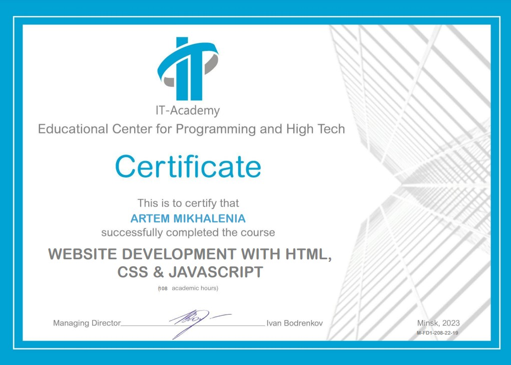

#The Rolling Scopes School CV
---
##Artem Mikhalenia
---
###Contacts
---
* ***Location:*** Minsk, Belarus
* ***Phone:*** +375 29 761-85-83
* ***Email:*** goldtree3000@gmail.com
* ***Telegram:*** [artemmikhalenia](https://t.me/artemmikhalenia)
* ***GitHub:*** [ArtemMikhalenia](https://github.com/ArtemMikhalenia)

###About me
---
I am 27 years old and work as a team leader in an international company. I love challenges, which is why I decided to become part of the IT community. I am a dynamic and adaptable individual with a passion for creativity and problem-solving. I believe that teamwork is the power that helps us achieve great goals.

###Skills
---
* *HTML5*
* *CSS3, SASS/SCSS, BEM*
* *JavaScript Basics*
* *VS Code*
* *Git, Github*
* *Figma, Zeplin*
* *Prepros*

###Code Example
---
**CodeWars Kata:** Coding in function ***isolateIt***. Your task is to put a character "|" into the middle of each element. If the string length is an even number, use the insert method. If the string length is an odd number, use the replacement method. The original array should not be changed, you need to return a new array.

```
function isolateIt(arr) {
         return arr.map((item) => {
            item = item.split('');
            (item.length % 2 !== 0) ? item.splice(item.length / 2, 1, '|') : item.splice(item.length / 2, 0, '|')
            return item.join('');
         });
      }
```

###Education
---
* Website Development with HTML, CSS & JavaScript (completed)

* Web Application Development with JavaScript (completed)

* JavaScript Manual on [learn.javascript.ru](https://learn.javascript.ru/) (in progress)
* RS Schools Course «JavaScript/Front-end. Stage 1» (in progress)

###Languages
---
* English - B2
* Russian - Native
* Belarusian - Native